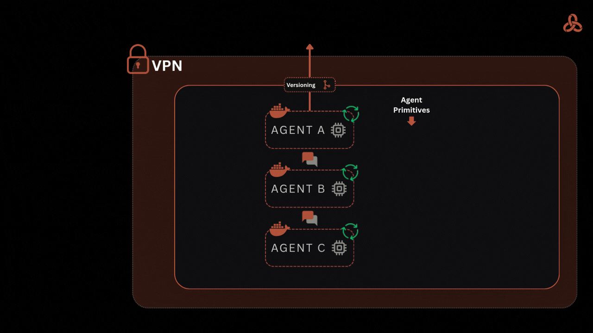

<p align="center">
  <a href="https://www.ability.ai/trinity">
    
  </a>
</p>

<p align="center">
  <a href="#quick-start"><strong>Quick start</strong></a> &middot;
  <a href="#your-whole-fleet-in-one-console"><strong>See it</strong></a> &middot;
  <a href="https://youtu.be/ivljtZqsxeo"><strong>Demo</strong></a> &middot;
  <a href="#documentation"><strong>Docs</strong></a> &middot;
  <a href="#community--support"><strong>Community</strong></a> &middot;
  <a href="https://www.ability.ai/trinity"><strong>Website</strong></a> &middot;
  <a href="https://www.ability.ai/workshops"><strong>Free workshops</strong></a>
</p>

<p align="center">
  <a href="https://github.com/abilityai/trinity/stargazers"></a>
  <a href="LICENSE"></a>
  <a href="https://pypi.org/project/trinity-cli/"></a>
  
  
  
</p>

---

## Run agents like infrastructure

Trinity is the production runtime for your AI agents — governed, auditable, on your own infrastructure.

> **Claude Code writes the agent. Trinity runs it in production.**

Each agent runs in its own isolated Docker container with real-time observability, fleet-wide scheduling, agent-to-agent delegation, and a tamper-evident audit trail. Self-host it, or run it on any cloud you control.

> Open source · **Apache 2.0** — free for any use, commercial included, and deploys anywhere you run it · Independently pentested — **UnderDefense Grade A** · We run Trinity in production ourselves — and so do our customers.

> 🤖 **AI agent reading this repo?** Start at [AGENTS.md](AGENTS.md) — a task router with exact commands, key facts, and verification steps. Detailed docs index: [docs/user-docs/README.md](docs/user-docs/README.md).

## Why Trinity?

**The problem:** Everyone wants autonomous AI agents. But your options are terrible — SaaS platforms where data leaves your security perimeter, custom builds that take 6-12 months, or frameworks that don't handle governance and audit trails.

**The solution:** Trinity is autonomous agent orchestration infrastructure. Each agent runs in its own isolated Docker container. You get real-time observability, fleet-wide health monitoring, cron-based scheduling, agent-to-agent delegation, and cost tracking — all on your own hardware.

| Option | Problem | Trinity |
|--------|---------|---------|
| **SaaS Platforms** | Data leaves your perimeter, vendor lock-in | Your infrastructure, data never leaves |
| **Build Custom** | 6-12 months, $500K+ engineering | Deploy in minutes |
| **Frameworks** | No observability, no fleet management | Real-time monitoring, scheduling, audit trails |

## See it move

<!-- TODO (asset): record a 30–60s interface walkthrough (e.g. fleet graph → a schedule firing),
     drag-drop the .mp4 into a GitHub PR/issue comment to mint a user-attachments URL, then
     uncomment the <video> block below and delete the interim image + this comment. -->

<p align="center">
  <a href="https://youtu.be/ivljtZqsxeo">
    
  </a>
</p>

<!--
<div align="center">
  <video src="https://github.com/user-attachments/assets/REPLACE-AFTER-UPLOAD" width="720" controls poster="docs/assets/screenshots/graph-view-fleet.png"></video>
</div>
-->

A short teaser of the live interface — the full, zoomable detail is in [the screenshots below](#your-whole-fleet-in-one-console).

**Watch more:**

- [Trinity Demo](https://youtu.be/ivljtZqsxeo) — full platform walkthrough
- [From Zero to Deployed AI Agent](https://youtu.be/-TSZyekDS6o) — your first Trinity agent in 30 minutes
- [Plugins + Trinity: Build and Deploy Agents in Cursor](https://youtu.be/amqiysdlEWY) — the plugin workflow end-to-end
- [Loops Engineering with Trinity](https://youtu.be/q3YvFYtuhec) — bounded autonomous work loops in practice
- [The Multi-Agent Platform I Run My Company On](https://youtu.be/8j6q-kABRqc) — live fleet tour: delegation, memory, observability
- [Autonomous Cornelius on Trinity](https://youtu.be/QUZ5ZgB5f6E) — a real second-brain agent running autonomously ([Cornelius on GitHub](https://github.com/Abilityai/cornelius))

More recordings — agent dev pipelines, GitHub-backed agents, an ops agent that deploys other agents — in the [workshop archive](https://www.ability.ai/workshops). Live and free, every Thursday.

## Up and running in minutes, not months

| | |
|---|---|
| **01 · Deploy an instance** | Self-host with one command, or run a managed instance on any cloud you control. |
| **02 · Connect Claude Code** | Install the [abilities plugins](https://github.com/abilityai/abilities) — scaffold, connect, and deploy agents over MCP. |
| **03 · Run in production** | Scheduled, multi-user, audited — inside your own perimeter. |

---

## Quick Start

Two phases: **stand up an instance** (Phase A), then **build and deploy agents to it** from Claude Code (Phase B).

### Phase A — Stand up a Trinity instance

**Prerequisites**

- Docker and Docker Compose v2+
- Anthropic API key (for Claude-powered agents) OR Google API key (for Gemini-powered agents)

**One-line install**

```bash
curl -fsSL https://raw.githubusercontent.com/abilityai/trinity/main/install.sh | bash
```

This clones the repository, configures the environment, builds the base image, and starts all services.

**Manual installation**

```bash
# 1. Clone the repository
git clone https://github.com/abilityai/trinity.git
cd trinity

# 2. Configure environment
cp .env.example .env
# Edit .env - at minimum set:
#   SECRET_KEY (generate with: openssl rand -hex 32)

# 3. Build the base agent image
./scripts/deploy/build-base-image.sh

# 4. Start all services
./scripts/deploy/start.sh
```

> Prefer a guided setup? `./quickstart.sh` walks you through it interactively (or `./quickstart.sh --defaults` for non-interactive bring-up with auto-generated secrets).

**First-time setup**

1. Open http://localhost — you'll be redirected to the setup wizard
2. Set your **admin password** (minimum 8 characters)
3. Log in with username `admin` and your new password
4. Go to **Settings** → **API Keys** to configure your Anthropic API key

**Access**

- **Web UI**: http://localhost
- **API Docs**: http://localhost:8000/docs
- **MCP Server**: http://localhost:8080/mcp

> **Don't want to self-host?** Trinity also runs as a managed instance on any cloud you control. [Talk to an engineer →](mailto:hello@ability.ai) — an engineer reads this, not a CRM. Reply in one business day, your time zone.

> **Deploying to a remote server?** `/trinity:deploy-new-instance` from the [abilities marketplace](https://github.com/abilityai/abilities) provisions Trinity on any server you can SSH into — and scaffolds an ops agent to manage it.

### Phase B — Build & deploy agents from Claude Code

Most of the Trinity workflow lives in the **[abilities plugin marketplace](https://github.com/abilityai/abilities)** — Claude Code plugins covering the full agent lifecycle: scaffold, develop, deploy, iterate. You need the instance from Phase A (localhost or remote) and [Claude Code](https://claude.com/claude-code).

```bash
# 1. Add the marketplace and install the core plugins (one-time)
/plugin marketplace add abilityai/abilities
/plugin install trinity@abilityai
/plugin install create-agent@abilityai

# 2. Connect to your Trinity instance (one-time)
/trinity:connect
#    → Instance URL + email verification code
#    → MCP API key auto-provisioned, .mcp.json written

# 3. Scaffold an agent — or start from any existing Claude Code agent directory
/create-agent:create
#    → Pick a wizard (prospector, chief-of-staff, recon, ghostwriter, kb-agent, …)
#      or /create-agent:custom for a blank canvas

# 4. Deploy it to Trinity
/trinity:onboard
#    → Compatibility check, creates the Trinity files, deploys + starts the container

# 5. Operate and iterate
/trinity:sync                                   # push/pull changes between local and remote
/trinity:loop @my-agent "work the backlog" 10 times   # bounded server-side task loops
/trinity:create-dashboard                       # scaffold a metrics dashboard for the agent
```

Once connected, Trinity's MCP tools (`list_agents`, `chat_with_agent`, schedules, executions, …) are available directly inside Claude Code — chat with remote agents, create cron schedules, and poll executions without leaving your editor.

> The marketplace also covers what happens *between* scaffold and deploy — adding skills, memory systems, GitHub backlog workflows, and autonomous work loops. See [Abilities — The Agent Development Toolkit](#abilities--the-agent-development-toolkit).

### Other ways to deploy

**Trinity CLI** — terminal-first alternative to the plugin workflow:

```bash
pip install trinity-cli                     # or: brew install abilityai/tap/trinity-cli

trinity init                                # connect: instance URL + email code → JWT + MCP key
cd my-agent/ && trinity deploy .            # package, upload, create + start the agent
trinity chat my-agent "Hello, what can you do?"
trinity logs my-agent                       # container logs
trinity health fleet                        # fleet overview
```

> Redeploys (`trinity deploy .` again), multi-instance profiles, and the full command reference: [CLI documentation](docs/CLI.md).

**Web UI** — open the Trinity web UI → **Create Agent** → pick a template (blank, built-in, or `github:org/repo@branch`) → configure credentials → start chatting.

**Multi-Agent System** — define a fleet in one YAML manifest and deploy via MCP (`mcp__trinity__deploy_system`) or the REST API. See [Multi-Agent Systems](#multi-agent-systems) below.

### For AI Agents

If you're an agent working with this repository, **[AGENTS.md](AGENTS.md)** is your entry point — a task router with exact commands, key facts (ports, auth, endpoints), and a verification step for every path above. For detailed feature documentation, use the index at **[docs/user-docs/README.md](docs/user-docs/README.md)**.

- **Deploy yourself to Trinity** → `/plugin install trinity@abilityai`, then `/trinity:connect` + `/trinity:onboard` — [AGENTS.md → Deploy an agent](AGENTS.md#deploy-an-agent-to-trinity)
- **Operate an existing instance** → MCP tools at `http://<instance>:8080/mcp` — [MCP Integration](#mcp-integration)
- **Contribute to Trinity itself** → [CLAUDE.md](CLAUDE.md) (auto-loaded by Claude Code) + [CONTRIBUTING.md](CONTRIBUTING.md)

---

## Your whole fleet, in one console

*Real screenshots from the Trinity control plane — the agents pictured are ours.*

<table>
  <tr>
    <td width="50%"><a href="docs/assets/screenshots/graph-view-fleet.png"></a><br/><sub><b>Graph view</b> — fleet topology, live status, cost & success rates per agent.</sub></td>
    <td width="50%"><a href="docs/assets/screenshots/timeline-fleet-activity.png"></a><br/><sub><b>Timeline</b> — execution history color-coded by trigger type.</sub></td>
  </tr>
  <tr>
    <td width="50%"><a href="docs/assets/screenshots/agent-dashboard-detail.png"></a><br/><sub><b>Agent dashboard</b> — custom widgets, historical tracking, sparklines.</sub></td>
    <td width="50%"><a href="docs/assets/screenshots/agent-terminal.png"></a><br/><sub><b>Live terminal</b> — ephemeral SSH into any agent container.</sub></td>
  </tr>
</table>

<!-- TODO (asset): capture the two shots called out in the update brief — a **schedules** view and the
     **Operating Room / operator-queue** view — at web-legible resolution and swap them in above
     (replacing agent-dashboard / agent-terminal, or extending the grid to 6). -->

## You've built the agents. Trinity is where they run.

<!-- TODO: confirm this competitor set matches the live /trinity landing page before publish. -->

| You're using… | Great for | Reach for Trinity when… |
|---|---|---|
| **Claude Code** | Writing & iterating on an agent on your laptop | …you need it running in production — multi-user, scheduled, observed, and audited. Trinity runs your Claude Code agent over MCP. |
| **OpenClaw / Hermes** | An open agent harness you control | …you want a production home for it: per-agent isolation, scheduling, and audit without building the platform yourself. |
| **Multica / Paperclip** | A managed, hosted agent team | …you need it self-hosted and company-governed — your infra, your perimeter, not SaaS. |

## Under the control plane, the infra you'd have built yourself

- **Agents that remember** — context persists between runs, versioned in Git so state is durable and reviewable.
- **Inside your perimeter** — self-hosted, behind your VPN, sandboxed per agent, credentials encrypted at rest.
- **Reach them where you work** — Slack, Telegram, WhatsApp, and webhooks, with verified-email access control.

The full feature set is below and in the [documentation](#documentation).

## Features

### Fleet Observability

- **Graph View** — Visual topology of your agent fleet with live status, success rates, cost tracking, and resource usage per agent
- **Timeline View** — Gantt-style execution timeline with trigger-based color coding (manual, scheduled, MCP, agent-triggered, public, paid)
- **Host Telemetry** — Real-time CPU, memory, and disk monitoring in the dashboard header
- **Fleet Health Monitoring** — Multi-layer health checks (Docker, network, business) with alerting and WebSocket updates
- **OpenTelemetry Metrics & Tracing** — Cost, token usage, and productivity tracking exportable to Grafana/Datadog; distributed traces across multi-agent calls

### Agent Runtime

- **Isolated Docker Containers** — Each agent runs in its own container with dedicated resources
- **Multi-Runtime Support** — Choose between Claude Code (Anthropic) or Gemini CLI (Google) per agent
- **Model Selection** — Choose which Claude model (Opus, Sonnet, Haiku) per task or schedule
- **Agent Dashboard** — Custom dashboards defined via `dashboard.yaml` with 11 widget types, historical tracking, and sparkline visualization
- **Playbooks** — Browse and invoke agent skills (`.claude/skills/`) directly from the UI
- **Dynamic Thinking Status** — Real-time status labels reflecting agent activity (Reading file, Searching code, etc.)
- **Persistent Memory** — File-based and database-backed memory across sessions
- **Full Capabilities Mode** — Optional elevated permissions for agents that need `apt-get`, `sudo`, etc.
- **Read-Only Mode** — Protect source code from modification while allowing output to designated directories
- **Runaway Prevention** — `max_turns` parameter limits agent execution depth
- **Guardrails** — Deterministic safety enforcement with configurable per-agent overrides (GUARD-001)
- **Persistent Async Backlog** — SQLite-backed FIFO queue for tasks that exceed parallel capacity, survives restarts
- **Execution Retry & Timeouts** — Automatic retry for failed scheduled executions; configurable per-agent execution timeouts

### Orchestration

- **Agent-to-Agent Communication** — Hierarchical delegation with fine-grained permission controls
- **Parallel Task Execution** — Stateless parallel tasks for orchestrator-worker patterns
- **Shared Folders** — File-based state sharing between agents via Docker volumes
- **System Manifest Deployment** — Deploy multi-agent systems from a single YAML configuration
- **Scheduling** — Cron-based automation with dedicated scheduler service and Redis distributed locks
- **MCP Integration** — 74 tools for external agent orchestration via Model Context Protocol
- **Trinity Connect** — WebSocket event streaming for local Claude Code integration
- **Channel Adapters** — Pluggable external messaging: Slack (Socket Mode + webhooks, per-channel agent binding), Telegram (DMs, groups, voice transcription, file uploads), and WhatsApp via Twilio (DMs, media, `/login` flow)
- **Unified Access Control** — Verified-email allow-list governs access across web, Slack, and Telegram with per-agent `require_email` / `open_access` policies (#311)
- **Proactive Messaging** — Agents initiate user conversations via `send_message` / `send_group_message` MCP tools (#321, #349)

### Operations

- **Template-Based Deployment** — Create agents from pre-configured templates or GitHub repos
- **Credential Management** — Direct file injection with encrypted git storage (`.credentials.enc`)
- **Per-Agent GitHub PAT** — Encrypted per-agent tokens override the global PAT for private template access (#347)
- **Subscription Management** — Centralized Claude Max/Pro subscription tokens shared across agents
- **Platform Audit Log** — Append-only cross-cutting audit trail for lifecycle, auth, and MCP events (SEC-001, admin-only API)
- **Role Hierarchy** — 4-tier RBAC (`user` < `operator` < `creator` < `admin`) with whitelist-driven role on first login
- **Agent Tags & System Views** — Organize agents with tags and saved filter views for fleet management
- **Live Execution Streaming** — Real-time streaming of execution logs to the web UI
- **Execution Termination** — Stop running executions gracefully via SIGINT/SIGKILL
- **Continue as Chat** — Resume failed or completed executions as interactive chat with full context
- **Agent Notifications** — Agents send structured notifications to platform with Events page UI
- **File Manager** — Browse, preview, and download agent workspace files via web UI
- **Ephemeral SSH Access** — Generate time-limited SSH credentials for direct agent terminal access
- **Public Agent Links** — Shareable links for unauthenticated agent access with session persistence and Slack integration
- **Paid Agent Access (x402)** — Per-agent monetization via Nevermined x402 payment protocol
- **Mobile Admin PWA** — Standalone mobile admin at `/m`, installable as a home screen app
- **First-Time Setup Wizard** — Guided setup for admin password and API key configuration

## Architecture

```
┌─────────────────────────────────────────────────────────────────┐
│                       Trinity Platform                           │
├─────────────────────────────────────────────────────────────────┤
│  Frontend (Vue.js)  │  Backend (FastAPI)  │  MCP Server         │
│      Port 80        │     Port 8000       │    Port 8080        │
├─────────────────────────────────────────────────────────────────┤
│  Scheduler Service  │  Redis (secrets +   │  SQLite (data)      │
│    Port 8001        │   distributed locks)│   /data volume      │
├─────────────────────────────────────────────────────────────────┤
│  Vector (logs)      │                                           │
│    Port 8686        │                                           │
├─────────────────────────────────────────────────────────────────┤
│                    Agent Containers                              │
│  ┌─────────┐  ┌─────────┐  ┌─────────┐  ┌────────────────┐    │
│  │ Agent 1 │  │ Agent 2 │  │ Agent N │  │ trinity-system │    │
│  └─────────┘  └─────────┘  └─────────┘  └────────────────┘    │
├─────────────────────────────────────────────────────────────────┤
│  (Optional) OTel Collector - Port 4317/8889 for metrics export  │
└─────────────────────────────────────────────────────────────────┘
```

## Project Structure

```
trinity/
├── src/
│   ├── backend/          # FastAPI backend API
│   ├── frontend/         # Vue.js 3 + Tailwind CSS web UI
│   ├── mcp-server/       # Trinity MCP server (74 tools)
│   ├── cli/              # Trinity CLI (pip install trinity-cli)
│   └── scheduler/        # Dedicated scheduler service (Redis locks)
├── docker/
│   ├── base-image/       # Universal agent base image
│   ├── backend/          # Backend Dockerfile
│   ├── frontend/         # Frontend Dockerfile
│   └── scheduler/        # Scheduler Dockerfile
├── config/
│   ├── agent-templates/  # Pre-configured agent templates
│   ├── vector.yaml       # Vector log aggregation config
│   ├── otel-collector.yaml # OpenTelemetry collector config
│   └── trinity-meta-prompt/ # Platform injection templates
├── scripts/
│   └── deploy/           # Deployment and management scripts
└── docs/                 # Documentation
```

## Agent Templates

Trinity deploys agents from templates. Templates define agent behavior, resources, and credential requirements.

### Template Structure

```
my-template/
├── template.yaml              # Metadata, resources, credentials
├── CLAUDE.md                  # Agent instructions (owned by agent)
├── .claude/                   # Claude Code configuration
│   ├── agents/               # Sub-agents (optional)
│   ├── commands/             # Slash commands (optional)
│   └── skills/               # Custom skills (optional)
├── .mcp.json.template        # MCP config with ${VAR} placeholders
└── .env.example              # Documents required env vars

# Generated at runtime by the platform (not in templates):
# CLAUDE.local.md              # Platform instructions (gitignored, managed by Trinity)
# .trinity/prompt.md           # Operator communication protocol
```

### Design Guides

| Guide | Use Case |
|-------|----------|
| [Trinity Compatible Agent Guide](docs/TRINITY_COMPATIBLE_AGENT_GUIDE.md) | **Single agents** — Template structure, CLAUDE.md, credentials, platform injection |
| [Multi-Agent System Guide](docs/MULTI_AGENT_SYSTEM_GUIDE.md) | **Multi-agent systems** — Architecture patterns, shared folders, coordination, deployment |

### Public Agent Templates

Trinity includes three reference agent implementations that demonstrate real-world agent patterns. These repositories are **public and available for use as templates** for your own agents:

| Agent | Repository | Purpose |
|-------|------------|---------|
| **Cornelius** | [github.com/abilityai/agent-cornelius](https://github.com/abilityai/agent-cornelius) | Knowledge Base Manager — Obsidian vault management, insight synthesis, research coordination |
| **Corbin** | [github.com/abilityai/agent-corbin](https://github.com/abilityai/agent-corbin) | Business Assistant — Google Workspace integration, task coordination, team management |
| **Ruby** | [github.com/abilityai/agent-ruby](https://github.com/abilityai/agent-ruby) | Content Creator — Multi-platform publishing, social media distribution, content strategy |

These agents demonstrate:
- Production-ready template structure with `template.yaml`, `CLAUDE.md`, and `.claude/` configuration
- Agent-to-agent collaboration patterns via Trinity MCP
- Custom metrics definitions for specialized tracking
- Credential management for external API integrations
- Real-world slash commands and workflow automation

**Usage**: Create agents from these templates via the Trinity UI:
```bash
# Via UI: Create Agent → Select "github:abilityai/agent-cornelius"
# Via MCP: trinity_create_agent(name="my-agent", template="github:abilityai/agent-cornelius")
```

**Note**: You'll need to configure a `GITHUB_PAT` environment variable in `.env` to use GitHub templates.

## Multi-Agent Systems

Deploy coordinated multi-agent systems from a single YAML manifest:

```yaml
name: content-production
description: Autonomous content pipeline

agents:
  orchestrator:
    template: github:abilityai/agent-corbin
    resources: {cpu: "2", memory: "4g"}
    folders: {expose: true, consume: true}
    schedules:
      - name: daily-review
        cron: "0 9 * * *"
        message: "Review today's content pipeline"

  writer:
    template: github:abilityai/agent-ruby
    folders: {expose: true, consume: true}

permissions:
  preset: full-mesh  # All agents can communicate
```

Deploy via MCP or API:
```bash
# Via MCP tool
mcp__trinity__deploy_system(manifest="...")

# Via REST API
curl -X POST http://localhost:8000/api/systems/deploy \
  -H "Content-Type: application/json" \
  -d '{"manifest": "...", "dry_run": false}'
```

See the [Multi-Agent System Guide](docs/MULTI_AGENT_SYSTEM_GUIDE.md) for architecture patterns and best practices.

## Abilities — The Agent Development Toolkit

> **[abilityai/abilities](https://github.com/abilityai/abilities)** is the canonical workflow for building and managing autonomous agents with Claude Code — most Trinity usage workflows are defined there as plugins.

Abilities structures agent work as a four-step lifecycle:

```
1. Scaffold              2. Develop                    3. Deploy                 4. Iterate
/create-agent:*          /agent-dev:create-playbook    /trinity:connect (once)   /trinity:sync
                         /agent-dev:add-memory         /trinity:onboard          /trinity:loop
                         /agent-dev:add-backlog        (or: trinity deploy .)    /create-agent:adjust
```

**Scaffold** — wizards like `/create-agent:prospector` or `/create-agent:custom` produce a fully configured, Trinity-compatible agent: `CLAUDE.md`, initial skills, `template.yaml`, a metrics dashboard, and an onboarding tracker.

**Develop** — `/agent-dev:create-playbook` adds capabilities, `/agent-dev:add-memory` adds persistence (file index, knowledge graph, JSON state, or workspace tracking), `/agent-dev:add-backlog` wires a GitHub Issues workflow.

**Deploy** — `/trinity:connect` once per instance, then `/trinity:onboard` per agent (or `trinity deploy .` via the CLI).

**Iterate** — `/trinity:sync` pushes and pulls changes, `/trinity:loop` runs bounded server-side task loops, `/create-agent:adjust` audits the agent against best practices and applies improvements.

The 5 plugins:

| Plugin | What it does |
|--------|-------------|
| **create-agent** | Agent scaffolding: a `/create-agent:create` discovery entry point + 12 wizards (prospector, chief-of-staff, webmaster, recon, receptionist, ghostwriter, kb-agent, doctor, website, custom, clone, adjust) |
| **agent-dev** | Extend existing agents: playbooks, memory systems, git-sync hooks, GitHub backlog workflow, grooming, sprints, agent-owned pipelines, autonomous work loops |
| **trinity** | The platform workflow: `connect`, `onboard`, `sync`, `loop`, `create-dashboard`, `deploy-new-instance` |
| **dev-methodology** | Documentation-driven development for any codebase: implementation, testing, security audits, PR validation, release, architecture/schema/config validation |
| **utilities** | Ops & productivity: incident investigation, safe deployment, Docker ops, batch processing, conversation export |

```bash
# Add the marketplace (one-time), then install the plugins you need
/plugin marketplace add abilityai/abilities
/plugin install trinity@abilityai
/plugin install create-agent@abilityai
```

See the **[abilities repository](https://github.com/abilityai/abilities)** for full plugin documentation and skill references.

## MCP Integration

Trinity includes an MCP server for external orchestration of agents:

```json
{
  "mcpServers": {
    "trinity": {
      "type": "streamable-http",
      "url": "http://localhost:8080/mcp",
      "headers": {
        "Authorization": "Bearer YOUR_API_KEY"
      }
    }
  }
}
```

### Available Tools

#### Agent Management
| Tool | Description |
|------|-------------|
| `list_agents` | List all agents with status |
| `get_agent` | Get detailed agent information |
| `get_agent_info` | Get agent template metadata (capabilities, commands, etc.) |
| `create_agent` | Create a new agent from template |
| `deploy_local_agent` | Package and deploy a local agent directory |
| `start_agent` / `stop_agent` | Start or stop an agent container |
| `rename_agent` | Rename an agent |
| `delete_agent` | Delete an agent |
| `initialize_github_sync` / `set_agent_github_pat` | GitHub sync and per-agent PAT management |

#### Communication
| Tool | Description |
|------|-------------|
| `chat_with_agent` | Send a message and get response (supports parallel and async modes) |
| `get_chat_history` | Retrieve conversation history |
| `get_agent_logs` | View container logs |
| `fan_out` | Dispatch N parallel tasks to an agent and collect results |
| `send_message` | Proactive user message by verified email (agent-initiated) |
| `send_group_message` / `list_channel_groups` | Proactive group messaging across Slack/Telegram |

> **Note**: Claude Code enforces a 60-second timeout on MCP HTTP tool calls. For longer tasks, use `async=true` with `parallel=true` to get an `execution_id` immediately and poll for results. See [Known Issues](docs/KNOWN_ISSUES.md) for details.

#### System Management
| Tool | Description |
|------|-------------|
| `deploy_system` | Deploy multi-agent system from YAML manifest |
| `list_systems` | List deployed systems with agent counts |
| `restart_system` | Restart all agents in a system |
| `get_system_manifest` | Export system configuration as YAML |

#### Configuration
| Tool | Description |
|------|-------------|
| `list_templates` | List available templates |
| `inject_credentials` | Inject credential files directly to agent |
| `get_credential_status` | Check credential files |
| `get_agent_ssh_access` | Generate ephemeral SSH credentials for direct terminal access |

#### Additional Tool Categories
- **Scheduling** (8 tools) — Create, list, update, delete, enable/disable schedules, trigger manually
- **Executions** (3 tools) — List recent executions, poll async results, get agent activity summaries
- **Tags** (5 tools) — List, get, set, add, remove agent tags for fleet organization
- **Subscriptions** (6 tools) — Register and assign Claude Max/Pro subscriptions to agents
- **Skills** (7 tools) — List, create, update, delete, assign skills to agents
- **Monitoring** (3 tools) — Get fleet health, agent health details, trigger health checks
- **Payments** (4 tools) — Configure Nevermined x402 payments, toggle, view payment history
- **Notifications** (1 tool) — Send structured notifications from agents to platform
- **Events** (4 tools) — Emit events, subscribe to agent events, list/delete subscriptions

## Trinity Connect

Trinity Connect enables real-time coordination between local Claude Code instances and Trinity-hosted agents via WebSocket event streaming.

```bash
# Install listener dependencies
brew install websocat jq

# Set your MCP API key (from Settings → API Keys)
export TRINITY_API_KEY="trinity_mcp_xxx"

# Listen for events from a specific agent
./scripts/trinity-listen.sh my-agent completed
```

The listener blocks until a matching event arrives, then prints the event and exits — perfect for event-driven automation loops:

```bash
while true; do
    ./scripts/trinity-listen.sh my-agent completed
    # React to the completed event...
done
```

Events include: `agent_started`, `agent_stopped`, `agent_activity` (chat/task completions), and `schedule_execution_completed`.

## Configuration

### Environment Variables

| Variable | Required | Description |
|----------|----------|-------------|
| `SECRET_KEY` | Yes | JWT signing key (generate with `openssl rand -hex 32`) |
| `ADMIN_PASSWORD` | Yes | Admin password for admin login |
| `ANTHROPIC_API_KEY` | No | For Claude-powered agents (can also be set via Settings UI) |
| `GITHUB_PAT` | No | GitHub PAT for cloning private template repos |
| `OTEL_ENABLED` | No | Enable OpenTelemetry metrics export (default: false) |
| `EMAIL_PROVIDER` | No | Email provider: console (dev), smtp, sendgrid, resend |
| `EXTRA_CORS_ORIGINS` | No | Additional CORS origins |

See [.env.example](.env.example) for the complete list.

### Authentication

Trinity supports two login methods:

1. **Email Login** (primary): Users enter email → receive 6-digit code → login
2. **Admin Login**: Password-based login for admin user

```bash
# Admin password (required)
ADMIN_PASSWORD=your-secure-password

# Email provider for verification codes
EMAIL_PROVIDER=console  # Use 'resend' or 'smtp' for production
```

## We run on Trinity. So do our customers.

<!-- TODO: verify these metrics are current before publishing — keep the qualifiers, they're what
     make the numbers credible. -->

- **1M+ agent runs / week** (internal)
- **99.94% scheduler uptime** (trailing 90 days)
- **0 unaudited tool calls** (in production)

**Security** — Trinity received a **Grade A (Excellent)** in an independent web application penetration test by [UnderDefense](https://underdefense.com) (April 2026). All critical and high findings from the initial assessment were fully remediated. See the [attestation letter](docs/security/UnderDefense-Web-Pentest-Attestation-Apr-2026.pdf).

**Data residency** — EU + US · BYOC available · no training on customer data.

## Documentation

- [**AGENTS.md**](AGENTS.md) — Entry point for AI agents: task router, key facts, verification steps
- [**Abilities Plugin Marketplace**](https://github.com/abilityai/abilities) — Claude Code plugins defining the agent lifecycle workflows (scaffold, develop, deploy, iterate)
- [**User Documentation**](docs/user-docs/README.md) — Complete guide for UI workflows, agent management, and API reference
- [**User Scenarios**](docs/user-scenarios/README.md) — Step-by-step task walkthroughs (CLI, UI, API)
- [CLI Reference](docs/CLI.md) — Full `trinity` command reference and multi-instance profiles
- [Deployment Guide](docs/DEPLOYMENT.md) — Production deployment instructions
- [Versioning & Upgrades](docs/VERSIONING_AND_UPGRADES.md) — Version strategy and upgrade procedures
- [Gemini Support Guide](docs/GEMINI_SUPPORT.md) — Using Gemini CLI runtime for cost optimization
- [Trinity Compatible Agent Guide](docs/TRINITY_COMPATIBLE_AGENT_GUIDE.md) — Creating Trinity-compatible agents
- [Multi-Agent System Guide](docs/MULTI_AGENT_SYSTEM_GUIDE.md) — Building multi-agent systems with coordinated workflows
- [Use Cases & Evaluation](docs/use-cases-evaluation.md) — Categorized autonomous multi-agent use cases with comparative analysis
- [Testing Guide](docs/TESTING_GUIDE.md) — Testing approach and standards
- [Contributing Guide](CONTRIBUTING.md) — How to contribute (PRs, code standards)
- [Known Issues](docs/KNOWN_ISSUES.md) — Current limitations and workarounds
- [Security Attestation](docs/security/UnderDefense-Web-Pentest-Attestation-Apr-2026.pdf) — Web pentest by UnderDefense (Apr 2026, Grade A — Excellent)

## Development

```bash
# Start in development mode (hot reload)
./scripts/deploy/start.sh

# View logs
docker compose logs -f backend
docker compose logs -f frontend

# Rebuild after changes
docker compose build backend
docker compose up -d backend
```

### Codebase Hygiene

Weekly maintenance skills to keep the codebase clean and consistent:

| Skill | What it checks |
|-------|---------------|
| `/validate-architecture` | 15 architectural invariants (layer separation, auth patterns, etc.) |
| `/validate-schema` | Schema drift between `db/schema.py`, `db/migrations.py`, and `architecture.md` |
| `/validate-config` | Env var consistency across `docker-compose.yml`, `.env.example`, and code |
| `/refactor-audit` | Dead code, complexity hotspots, large files/functions |
| `/cso --supply-chain` | Dependency freshness and known CVEs |
| `/tidy` | Orphan files, misplaced configs, test artifacts |

### Releasing the CLI

The CLI auto-publishes to PyPI and Homebrew on every push to `main` that changes `src/cli/`. The patch version auto-increments from the latest `cli-v*` tag.

For explicit major/minor bumps, tag manually:

```bash
git tag cli-v1.0.0
git push origin cli-v1.0.0
```

## License

This project is licensed under the [Apache License 2.0](LICENSE) — free for any use, commercial included, with an explicit patent grant. Run it on your own infrastructure, any cloud, or a managed instance.

Optional **enterprise modules** (SSO, user management, SIEM export, and more) are available under a separate commercial license. Contact [hello@ability.ai](mailto:hello@ability.ai) for enterprise licensing.

## Contributing

See [CONTRIBUTING.md](CONTRIBUTING.md) for guidelines.

## Community & Support

- **Ask Trinity**: [docs.ability.ai](https://docs.ability.ai) — full documentation with a built-in agent you can chat with for instant answers
- **GitHub Issues**: [Report bugs](https://github.com/abilityai/trinity/issues) — the public tracker is for bugs & core maintenance
- **GitHub Discussions**: [Request features, ask questions, share ideas](https://github.com/abilityai/trinity/discussions) — feature ideas are triaged into the roadmap here
- **Videos**: [Trinity Demo](https://youtu.be/ivljtZqsxeo) · [Loops Engineering](https://youtu.be/q3YvFYtuhec) · [Autonomous Cornelius](https://youtu.be/QUZ5ZgB5f6E)
- **Free Workshops**: [Live every Thursday + full recording archive](https://www.ability.ai/workshops)
- **Security Issues**: See [SECURITY.md](SECURITY.md) for reporting vulnerabilities
- **Commercial inquiries**: [hello@ability.ai](mailto:hello@ability.ai)

---

<div align="center">
  <sub>Built by <a href="https://ability.ai">Ability.ai</a> — Sovereign AI infrastructure for the autonomous enterprise</sub>
</div>
